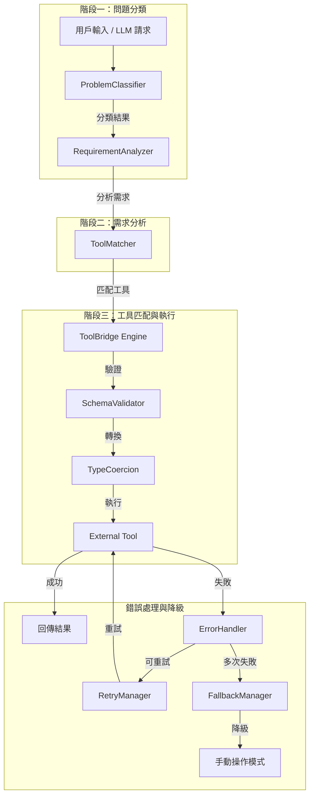
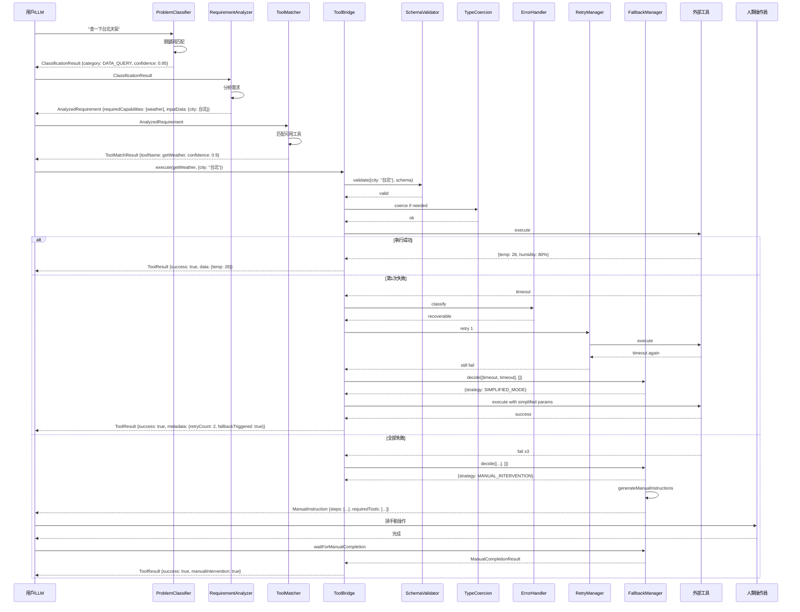
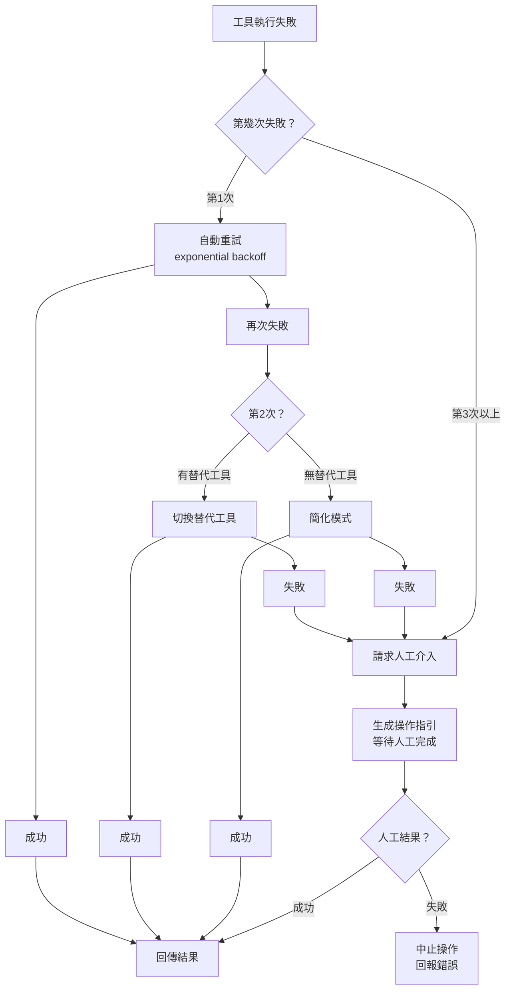
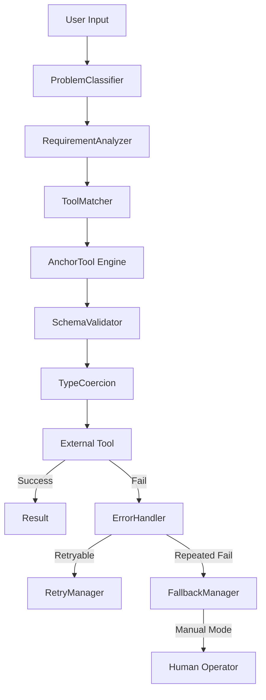

# NAD - AnchorTool — 輕量級 AI Agent 工具呼叫引擎

## 專案概述

**AnchorTool**（專案代號：NAD）是一個專注解決 **AI Agent 工具使用可靠性** 的輕量級 TypeScript 插件。核心目標是讓 LLM 的工具呼叫更穩定、更可預測、更容易除錯，像船錨一樣穩固地錨定每一次工具呼叫。

### 核心創新

1. **問題分類 → 需求分析 → 工具匹配** 的三階段決策流程
2. **多次錯誤後自動降級為手動操作** 的容錯機制

---

## 一、目錄結構

```
NAD-AnchorTool/
├── .github/
│   └── workflows/
│       └── ci.yml              # GitHub Actions CI 配置
├── src/
│   ├── index.ts                # 主入口，匯出所有公開 API
│   ├── core/
│   │   ├── ToolBridge.ts       # 核心引擎類別
│   │   ├── types.ts            # 核心型別定義
│   │   └── errors.ts           # 錯誤類型定義
│   ├── classifier/
│   │   ├── ProblemClassifier.ts # 問題分類器
│   │   ├── RequirementAnalyzer.ts # 需求分析器
│   │   └── ToolMatcher.ts      # 工具匹配器
│   ├── validator/
│   │   ├── SchemaValidator.ts  # Schema 驗證器
│   │   └── TypeCoercion.ts     # 型別自動轉換
│   ├── handler/
│   │   ├── ErrorHandler.ts     # 錯誤分類與處理
│   │   ├── RetryManager.ts     # 重試邏輯管理
│   │   └── FallbackManager.ts  # 降級管理（手動操作）
│   └── plugins/
│       ├── PluginManager.ts    # 插件管理器
│       └── builtin/
│           ├── Calculator.ts   # 內建計算機工具範例
│           └── Weather.ts      # 內建天氣工具範例
├── tests/
│   ├── core/
│   │   ├── ToolBridge.test.ts
│   │   └── types.test.ts
│   ├── classifier/
│   │   ├── ProblemClassifier.test.ts
│   │   ├── RequirementAnalyzer.test.ts
│   │   └── ToolMatcher.test.ts
│   ├── validator/
│   │   ├── SchemaValidator.test.ts
│   │   └── TypeCoercion.test.ts
│   └── handler/
│       ├── ErrorHandler.test.ts
│       ├── RetryManager.test.ts
│       └── FallbackManager.test.ts
├── examples/
│   ├── basic-usage.ts          # 基本使用範例
│   └── with-langchain.ts       # 與 LangChain 整合範例
├── package.json
├── tsconfig.json
├── vitest.config.ts
├── .gitignore
├── LICENSE                     # MIT License
└── README.md
```

---

## 二、核心架構：三階段決策流程



---

## 三、核心資料結構

### 3.1 問題分類

```typescript
// src/classifier/types.ts

/**
 * 問題分類
 * 將用戶的輸入分類，決定要用什麼策略處理
 */
type ProblemCategory =
  | 'DATA_QUERY'          // 資料查詢（查天氣、查價格等）
  | 'COMPUTATION'         // 計算（數學運算、統計等）
  | 'TRANSFORMATION'      // 資料轉換（格式轉換、翻譯等）
  | 'CONTENT_GENERATION'  // 內容生成（寫文章、寫程式等）
  | 'WORKFLOW'            // 工作流程（多步驟任務）
  | 'SYSTEM_OPERATION'    // 系統操作（檔案操作、API 呼叫等）
  | 'UNKNOWN';            // 無法分類

/**
 * 問題分類結果
 */
interface ClassificationResult {
  category: ProblemCategory;
  confidence: number;          // 信心指數 0-1
  keywords: string[];          // 提取的關鍵詞
  originalInput: string;
}

/**
 * 分類規則
 * 定義什麼關鍵詞對應什麼分類
 */
interface ClassificationRule {
  category: ProblemCategory;
  patterns: RegExp[];
  priority: number;            // 優先級，越高越優先
}
```

### 3.2 需求分析

```typescript
// src/classifier/RequirementAnalyzer.ts

/**
 * 分析後的需求
 * 從分類結果中提取具體需求
 */
interface AnalyzedRequirement {
  /** 需要什麼類型的工具 */
  requiredCapabilities: string[];
  
  /** 輸入資料 */
  inputData: Record<string, unknown>;
  
  /** 期望的輸出格式 */
  expectedOutputType: string;
  
  /** 約束條件 */
  constraints: {
    timeout?: number;
    precision?: number;        // 計算精度
    format?: string;           // 輸出格式
    maxRetries?: number;
  };
  
  /** 是否需要人工確認 */
  requiresHumanConfirmation: boolean;
}

class RequirementAnalyzer {
  /**
   * 根據分類結果分析具體需求
   */
  analyze(classification: ClassificationResult): AnalyzedRequirement;
}
```

### 3.3 工具匹配

```typescript
// src/classifier/ToolMatcher.ts

/**
 * 工具匹配結果
 */
interface ToolMatchResult {
  matched: boolean;
  toolName?: string;
  confidence: number;
  alternativeTools: string[];   // 備選工具
  suggestedArgs?: Record<string, unknown>;
}

class ToolMatcher {
  /**
   * 根據需求匹配最適合的工具
   * 
   * 匹配策略：
   * 1. 精確匹配：工具名稱/描述完全符合需求
   * 2. 語義匹配：透過關鍵詞相似度匹配
   * 3. 備選匹配：如果沒有精確匹配，提供最接近的選項
   */
  match(
    requirement: AnalyzedRequirement,
    availableTools: ToolDefinition[]
  ): ToolMatchResult;
}
```

### 3.4 工具定義（更新）

```typescript
// src/core/types.ts

/**
 * 工具定義
 */
interface ToolDefinition {
  name: string;
  description: string;
  
  /** 工具的能力標籤，用於 ToolMatcher 匹配 */
  capabilities: string[];
  
  /** 適用的問題分類 */
  applicableCategories: ProblemCategory[];
  
  /** 參數 Schema */
  parameters: Record<string, ToolParameterSchema>;
  
  /** 執行函式 */
  execute: (args: Record<string, unknown>) => Promise<ToolResult>;
}

/**
 * 工具參數的 JSON Schema 定義
 */
interface ToolParameterSchema {
  type: 'string' | 'number' | 'boolean' | 'array' | 'object';
  description: string;
  required?: boolean;
  enum?: string[];
  default?: unknown;
  items?: ToolParameterSchema;
  properties?: Record<string, ToolParameterSchema>;
}

/**
 * 工具執行結果
 */
interface ToolResult {
  success: boolean;
  data?: unknown;
  error?: ToolError;
  metadata?: {
    duration: number;
    retryCount: number;
    validationPassed: boolean;
    fallbackTriggered: boolean;   // 是否觸發降級
    manualIntervention: boolean;  // 是否需要人工介入
  };
}
```

### 3.5 錯誤類型

```typescript
// src/core/errors.ts

type ErrorCategory =
  | 'VALIDATION_ERROR'     // 參數驗證失敗
  | 'TYPE_MISMATCH'        // 型別不符
  | 'EXECUTION_ERROR'      // 執行階段錯誤
  | 'TIMEOUT_ERROR'        // 超時
  | 'TOOL_NOT_FOUND'       // 找不到工具
  | 'MATCH_ERROR'          // 工具匹配失敗
  | 'CLASSIFICATION_ERROR' // 問題分類失敗
  | 'PLUGIN_LOAD_ERROR';   // 插件載入失敗

interface ToolError {
  category: ErrorCategory;
  message: string;
  code: string;
  recoverable: boolean;
  details?: unknown;
  /** 建議的替代方案 */
  suggestion?: string;
}
```

---

## 四、核心 API 設計

### 4.1 ToolBridge 主引擎

```typescript
// src/core/ToolBridge.ts

class ToolBridge {
  constructor(config?: BridgeConfig);

  // === 三階段決策流程 ===
  
  /**
   * 完整流程：分類 → 分析 → 匹配 → 執行
   * 這是主要入口
   */
  async process(input: string): Promise<ProcessResult>;
  
  /**
   * 階段一：問題分類
   */
  classify(input: string): ClassificationResult;
  
  /**
   * 階段二：需求分析
   */
  analyze(classification: ClassificationResult): AnalyzedRequirement;
  
  /**
   * 階段三：工具匹配
   */
  matchTool(requirement: AnalyzedRequirement): ToolMatchResult;

  // === 工具註冊 ===
  
  registerTool(tool: ToolDefinition): void;
  registerTools(tools: ToolDefinition[]): void;
  unregisterTool(name: string): void;
  getTools(): ToolDefinition[];

  // === 工具執行 ===
  
  async execute(
    toolName: string,
    args: Record<string, unknown>,
    options?: ExecuteOptions
  ): Promise<ToolResult>;

  // === 格式轉換 ===
  
  toOpenAITools(): OpenAITool[];
  toAnthropicTools(): AnthropicTool[];
}

interface BridgeConfig {
  enableTypeCoercion?: boolean;
  maxRetries?: number;
  timeout?: number;
  strictMode?: boolean;
  
  /** 降級策略配置 */
  fallback?: {
    /** 觸發降級前的最大重試次數（預設: 3） */
    maxRetriesBeforeFallback: number;
    /** 是否啟用手動降級（預設: true） */
    enableManualFallback: boolean;
    /** 手動操作的超時時間 ms（預設: 300000 = 5分鐘） */
    manualTimeout: number;
  };
}

interface ExecuteOptions {
  retries?: number;
  timeout?: number;
  context?: Record<string, unknown>;
}

/**
 * 完整處理流程的結果
 */
interface ProcessResult {
  success: boolean;
  data?: unknown;
  
  /** 三階段的詳細記錄 */
  pipeline: {
    classification: ClassificationResult;
    requirement: AnalyzedRequirement;
    match: ToolMatchResult;
    execution: ToolResult;
  };
  
  /** 是否觸發了降級 */
  fallbackTriggered: boolean;
  
  /** 是否需要人工介入 */
  needsManualIntervention: boolean;
  
  /** 人工操作的指引（如果需要的話） */
  manualInstructions?: string;
}
```

### 4.2 問題分類器

```typescript
// src/classifier/ProblemClassifier.ts

class ProblemClassifier {
  constructor(rules?: ClassificationRule[]);
  
  /**
   * 對輸入進行分類
   * 
   * 分類策略：
   * 1. 關鍵詞匹配（優先）
   * 2. 正則表達式模式匹配
   * 3. 如果都無法匹配，回退為 UNKNOWN
   */
  classify(input: string): ClassificationResult;
  
  /**
   * 添加自訂分類規則
   */
  addRule(rule: ClassificationRule): void;
  
  /**
   * 取得所有分類規則
   */
  getRules(): ClassificationRule[];
}

// 預設分類規則範例
const defaultRules: ClassificationRule[] = [
  {
    category: 'DATA_QUERY',
    patterns: [/weather|temperature|forecast/i, /price|stock|rate/i],
    priority: 10
  },
  {
    category: 'COMPUTATION',
    patterns: [/calculate|compute|sum|average|math/i, /\d+\s*[+\-*/]/],
    priority: 10
  },
  {
    category: 'TRANSFORMATION',
    patterns: [/convert|transform|translate|format/i],
    priority: 8
  },
  {
    category: 'WORKFLOW',
    patterns: [/step|pipeline|workflow|sequence|then/i],
    priority: 6
  }
];
```

### 4.3 Schema 驗證器

```typescript
// src/validator/SchemaValidator.ts

class SchemaValidator {
  validate(
    params: Record<string, unknown>,
    schema: Record<string, ToolParameterSchema>
  ): ValidationResult;
}

interface ValidationResult {
  valid: boolean;
  errors: ValidationError[];
  coerced: Record<string, unknown>;
}

interface ValidationError {
  path: string;
  message: string;
  expected: string;
  received: string;
}
```

### 4.4 型別自動轉換

```typescript
// src/validator/TypeCoercion.ts

class TypeCoercion {
  coerce(
    value: unknown,
    targetType: string
  ): CoercionResult;
}

interface CoercionResult {
  success: boolean;
  value: unknown;
  warning?: string;
}
```

---

## 五、錯誤處理與降級機制

### 5.1 錯誤處理

```typescript
// src/handler/ErrorHandler.ts

class ErrorHandler {
  /**
   * 分類錯誤，決定是否可重試
   * 
   * 可重試錯誤：
   *   - 網路超時
   *   - API rate limit
   *   - 型別轉換失敗（可修正後重試）
   * 
   * 不可重試錯誤：
   *   - Schema 驗證失敗（參數根本不存在）
   *   - 工具不存在
   *   - 權限不足
   */
  classify(error: unknown): ToolError;
  
  /**
   * 根據錯誤生成建議
   */
  getSuggestion(error: ToolError): string;
}
```

### 5.2 重試管理

```typescript
// src/handler/RetryManager.ts

class RetryManager {
  /**
   * 執行帶重試邏輯的工具呼叫
   * 使用 exponential backoff
   */
  async executeWithRetry(
    fn: () => Promise<ToolResult>,
    options: RetryOptions
  ): Promise<ToolResult>;
}

interface RetryOptions {
  maxRetries: number;
  baseDelay: number;
  maxDelay: number;
  onRetry?: (attempt: number, error: ToolError) => void;
}
```

### 5.3 降級管理（核心新功能）

```typescript
// src/handler/FallbackManager.ts

/**
 * 降級策略
 */
type FallbackStrategy =
  | 'AUTO_RETRY'          // 自動重試（預設）
  | 'ALTERNATIVE_TOOL'    // 切換到替代工具
  | 'SIMPLIFIED_MODE'     // 簡化模式（降低參數要求）
  | 'MANUAL_INTERVENTION' // 請求人工介入
  | 'ABORT';              // 中止操作

/**
 * 降級決策
 */
interface FallbackDecision {
  strategy: FallbackStrategy;
  reason: string;
  
  /** 如果是 ALTERNATIVE_TOOL，提供替代工具 */
  alternativeTool?: string;
  
  /** 如果是 MANUAL_INTERVENTION，提供操作指引 */
  manualInstructions?: ManualInstruction;
}

/**
 * 人工操作指引
 * 當自動化完全失敗時，生成給人類操作的步驟說明
 */
interface ManualInstruction {
  /** 問題描述 */
  problem: string;
  
  /** 預期要達成的目標 */
  goal: string;
  
  /** 具體操作步驟 */
  steps: string[];
  
  /** 需要的工具或資訊 */
  requiredTools: string[];
  
  /** 操作完成後如何通知系統 */
  completionAction: {
    type: 'COMMAND' | 'API_CALL' | 'FILE_UPDATE';
    details: string;
  };
}

class FallbackManager {
  /**
   * 根據錯誤歷史決定降級策略
   * 
   * 決策邏輯：
   * - 第 1 次失敗 → AUTO_RETRY
   * - 第 2 次失敗 → ALTERNATIVE_TOOL（如果有備選）
   * - 第 3 次失敗 → SIMPLIFIED_MODE
   * - 第 4 次失敗 → MANUAL_INTERVENTION
   * - 超過 5 次 → ABORT
   */
  decide(
    errorHistory: ToolError[],
    availableAlternatives: string[]
  ): FallbackDecision;
  
  /**
   * 生成人工操作指引
   * 當決定需要人工介入時，產生詳細的操作步驟
   */
  generateManualInstructions(
    originalInput: string,
    errorHistory: ToolError[],
    context: Record<string, unknown>
  ): ManualInstruction;
  
  /**
   * 等待人工操作完成
   * 回傳人工操作的結果
   */
  async waitForManualCompletion(
    instruction: ManualInstruction,
    timeout: number
  ): Promise<ManualCompletionResult>;
}

interface ManualCompletionResult {
  completed: boolean;
  result?: unknown;
  error?: string;
  duration: number;
}
```

---

## 六、完整執行流程



---

## 七、降級策略決策樹



---

## 八、Plugin 架構

```typescript
// src/plugins/PluginManager.ts

interface ToolPlugin {
  meta: {
    name: string;
    version: string;
    description: string;
  };
  
  /** 插件提供的工具列表 */
  tools: ToolDefinition[];
  
  /** 插件提供的分類規則（可選） */
  classificationRules?: ClassificationRule[];
  
  /** 插件初始化 */
  init?: (context: PluginContext) => Promise<void>;
  
  /** 插件清理 */
  cleanup?: () => Promise<void>;
}

interface PluginContext {
  bridge: ToolBridge;
  config: Record<string, unknown>;
  logger: Logger;
}

class PluginManager {
  async load(plugin: ToolPlugin): Promise<void>;
  async loadFromPath(path: string): Promise<void>;
  async unload(name: string): Promise<void>;
  list(): ToolPlugin[];
}
```

---

## 九、測試策略

| 測試層級 | 工具 | 涵蓋範圍 |
|---------|------|---------|
| Unit Test | Vitest | 每個類別獨立測試 |
| Integration Test | Vitest | 三階段流程整合測試 |
| Fallback Test | Vitest | 降級策略完整測試 |
| Fuzz Test | 自訂 | 亂數產生各種錯誤情境 |

### 關鍵測試案例

```
✅ 問題分類 — DATA_QUERY 關鍵詞匹配
✅ 問題分類 — COMPUTATION 模式匹配
✅ 問題分類 — UNKNOWN 回退
✅ 需求分析 — 從分類提取參數
✅ 工具匹配 — 精確匹配
✅ 工具匹配 — 語義匹配
✅ 工具匹配 — 無匹配時提供備選
✅ Schema 驗證 — 缺少必要參數
✅ Schema 驗證 — 參數型別錯誤
✅ 型別轉換 — string "42" → number 42
✅ 型別轉換 — 無效轉換回退
✅ 錯誤分類 — 可重試 vs 不可重試
✅ 重試邏輯 — exponential backoff
✅ 降級策略 — 第1次失敗自動重試
✅ 降級策略 — 第2次失敗切換替代工具
✅ 降級策略 — 第3次失敗簡化模式
✅ 降級策略 — 多次失敗後請求人工介入
✅ 降級策略 — 人工操作完成後繼續流程
✅ Plugin 載入與卸載
✅ 完整流程整合測試
```

---

## 十、GitHub 倉庫配置

### 10.1 README.md 結構（中英文雙語）

```markdown
# NAD - AnchorTool 🪨

> **EN:** A lightweight AI Agent tool-calling engine that anchors every tool call with reliability.
> **ZH:** 輕量級 AI Agent 工具呼叫引擎，像船錨一樣穩固錨定每一次工具呼叫。

---

## Features / 特色

| English | 中文 |
|---------|------|
| 🪶 **Ultra-lightweight** - Core < 800 lines, zero dependencies | 🪶 **超輕量** — 核心 < 800 行，零依賴 |
| 🧠 **3-Stage Decision Pipeline** - Problem Classification → Requirement Analysis → Tool Matching | 🧠 **三階段決策** — 問題分類 → 需求分析 → 工具匹配 |
| 🔒 **Strong Type Validation** - Auto-fix LLM parameter errors | 🔒 **強型別驗證** — 自動修正 LLM 的參數錯誤 |
| 🔄 **Smart Retry** - Exponential backoff with error classification | 🔄 **智慧重試** — exponential backoff 自動重試 |
| 🛟 **Auto Fallback** - Graceful degradation to manual mode after repeated failures | 🛟 **自動降級** — 多次失敗後自動切換到手動模式 |
| 🔌 **Plugin Architecture** - Easy to extend with custom tools and rules | 🔌 **Plugin 架構** — 輕鬆擴充自訂工具和分類規則 |
| 🤝 **Framework Agnostic** - Works with OpenAI / Anthropic / LangChain | 🤝 **框架無關** — 支援 OpenAI / Anthropic / LangChain |

---

## Quick Start / 快速開始

```bash
npm install nad-anchortool
```

### Basic Usage / 基本使用

```typescript
import { AnchorTool } from 'nad-anchortool';

// Initialize / 初始化
const anchor = new AnchorTool();

// Register a tool / 註冊工具
anchor.registerTool({
  name: 'getWeather',
  description: 'Get weather for a city',
  capabilities: ['weather', 'query'],
  applicableCategories: ['DATA_QUERY'],
  parameters: {
    city: { type: 'string', description: 'City name', required: true }
  },
  execute: async (args) => {
    // your tool logic here
    return { success: true, data: { temperature: 28 } };
  }
});

// Process input / 處理輸入
const result = await anchor.process('查一下台北天氣');
// Pipeline: classify('查一下台北天氣') → analyze() → matchTool() → execute()
console.log(result);
```

---

## Architecture / 架構



---

## Documentation / 文件

- [English Documentation](./docs/en/README.md)
- [中文文档](./docs/zh/README.md)

---

## Contributing / 貢獻指南

**EN:** Contributions are welcome! Please read [CONTRIBUTING.md](./CONTRIBUTING.md) first.
**ZH:** 歡迎貢獻！請先閱讀 [CONTRIBUTING.md](./CONTRIBUTING.md)。

---

## License / 許可證

MIT © NAD Team
```

### 10.2 CI/CD

```yaml
# .github/workflows/ci.yml
name: CI
on: [push, pull_request]
jobs:
  test:
    runs-on: ubuntu-latest
    steps:
      - uses: actions/checkout@v4
      - uses: actions/setup-node@v4
        with:
          node-version: 20
      - run: npm ci
      - run: npm test
      - run: npm run build
  publish:
    needs: test
    if: startsWith(github.ref, 'refs/tags/')
    runs-on: ubuntu-latest
    steps:
      - uses: actions/checkout@v4
      - uses: actions/setup-node@v4
        with:
          node-version: 20
          registry-url: https://registry.npmjs.org/
      - run: npm ci
      - run: npm run build
      - run: npm publish
        env:
          NODE_AUTH_TOKEN: ${{ secrets.NPM_TOKEN }}
```

### 10.3 package.json

```json
{
  "name": "nad-anchortool",
  "version": "0.1.0",
  "description": "輕量級 AI Agent 工具呼叫引擎 - 問題分類、需求分析、工具匹配、自動降級",
  "main": "dist/index.js",
  "types": "dist/index.d.ts",
  "files": ["dist"],
  "scripts": {
    "build": "tsc",
    "test": "vitest run",
    "test:watch": "vitest",
    "lint": "eslint src/",
    "prepublishOnly": "npm run build"
  },
  "keywords": [
    "ai", "agent", "llm", "tool-use",
    "function-calling", "plugin",
    "classification", "fallback"
  ],
  "license": "MIT"
}
```

### 10.4 .gitignore

```
node_modules/
dist/
coverage/
.env
*.tsbuildinfo
```

---

## 十一、實作步驟（給 Code Mode 使用）

| 步驟 | 內容 | 關鍵檔案 |
|------|------|---------|
| 1 | 初始化專案：package.json, tsconfig, vitest config | 根目錄配置檔 |
| 2 | 實作核心型別：types.ts, errors.ts | `src/core/` |
| 3 | 實作 ProblemClassifier + 預設分類規則 | `src/classifier/` |
| 4 | 實作 RequirementAnalyzer | `src/classifier/` |
| 5 | 實作 ToolMatcher | `src/classifier/` |
| 6 | 實作 SchemaValidator + TypeCoercion | `src/validator/` |
| 7 | 實作 ErrorHandler + RetryManager | `src/handler/` |
| 8 | 實作 FallbackManager（降級 + 手動操作） | `src/handler/` |
| 9 | 實作 ToolBridge 主引擎（整合三階段流程） | `src/core/ToolBridge.ts` |
| 10 | 實作 PluginManager | `src/plugins/` |
| 11 | 撰寫內建工具範例（Calculator, Weather） | `src/plugins/builtin/` |
| 12 | 撰寫單元測試 | `tests/` |
| 13 | 撰寫使用範例 | `examples/` |
| 14 | 撰寫 README.md | 根目錄 |
| 15 | 配置 GitHub Actions CI | `.github/workflows/` |
| 16 | 上傳 GitHub | `git init && git push` |

---

## 十二、上傳 GitHub 步驟

```bash
# 1. 在專案目錄中初始化 git
cd NAD-AnchorTool
git init

# 2. 加入所有檔案
git add .
git commit -m "feat: initial release - ToolBridge v0.1.0"

# 3. 在 GitHub 上建立新倉庫（透過網頁）
#    不要勾選 README、.gitignore、License

# 4. 連結遠端倉庫並推送
git remote add origin https://github.com/<你的帳號>/NAD-AnchorTool.git
git branch -M main
git push -u origin main

# 5. 發布到 npm（可選）
npm publish
```
